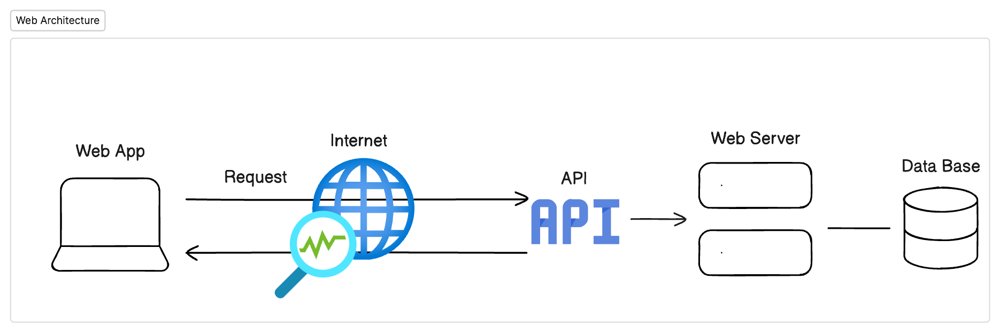
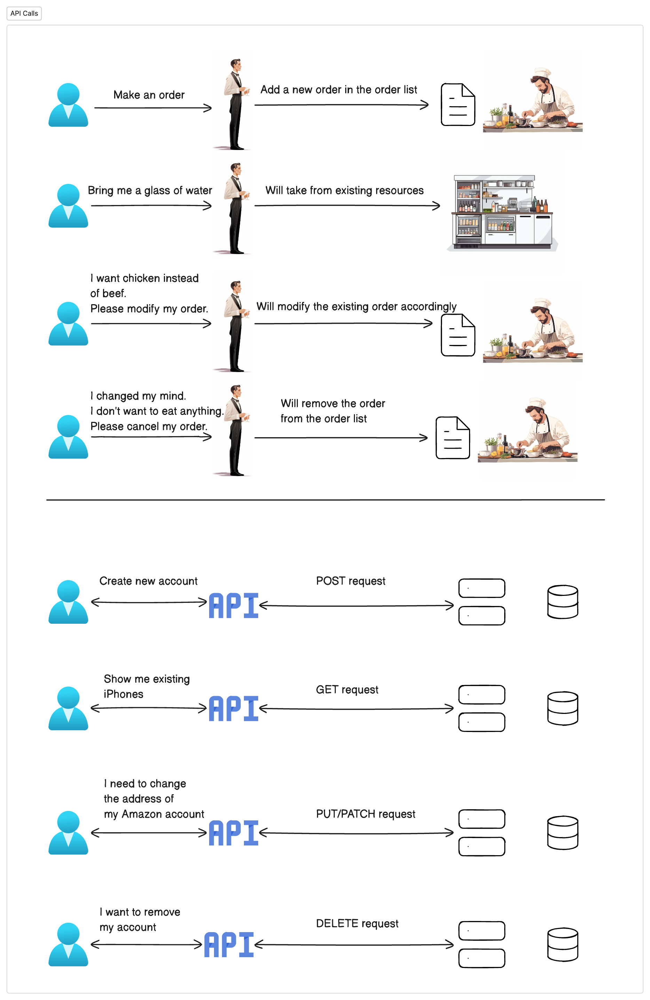

# Introduction to Selenium Class
## Why Learn Selenium?
- **Automate Web Interactions:** [Selenium](https://www.selenium.dev/documentation/) lets us automate tasks on websites, like clicking buttons and filling forms, without doing them manually. 
- **Use Your Programming Skills:** If you know a programming language like Java or Python, you can use Selenium to control browsers and test web applications. 
- **Simplify Complex Tasks:** While you could try to automate web tasks with just programming, it's complicated. Selenium provides tools that make it much easier.

### What is an application?
>**An application**,often referred to as an app, is a software program or a group of programs designed to perform a specific function or set of functions for the user. Applications can be created for various purposes, including productivity, entertainment, education, communication, and business operations. They can run on different platforms, such as desktop computers, mobile devices, web browsers, or cloud-based services. Examples of applications include word processors, games, messaging apps, database management systems, and web browsers.

### What Kind of Applications Will We Work With?
> ###### Our focus will be on testing web applications.

##### Key Concepts to Understand About Web Applications
- __URL/Address:__ Each web application has a unique address, known as a URL (Uniform Resource Locator), that we use to access it. This can be found through a search engine like Google or by using a direct link.
- __Web Server:__ A web server is a powerful computer dedicated to running and executing the code of web applications. It hosts the application and serves it to users over the internet. Whether the server is individual or corporate, as long as it has internet access and is active, we can access the application using its URL.
- __Web Application:__ This is the software program designed to solve a specific problem or fulfill a particular need, such as helping you purchase a new TV. It's made up of code that runs on a web server and is accessed through a web browser.
- __Web Page:__ A web application typically consists of multiple web pages. Each web page focuses on a specific aspect of the application and contains a unique selection of elements, such as text, images, and interactive components.

### The web applications can be categorized into two groups:
- ##### Static Web Applications:
  - Content is fixed and does not change unless manually updated by the webmaster. 
  - Every user sees the same content, similar to reading a printed brochure. 
  - Typically consists of HTML, CSS, and can include JavaScript for client-side interactivity, but not for fetching or displaying server-side data. 
  - Examples: A portfolio website, a company's informational site with minimal user interaction.
- ##### Dynamic Web Applications:
  - Content is dynamic and can change based on user interaction, time, location, etc.
  - Often involves client-side scripting (JavaScript) and server-side scripting (PHP, ASP, Python, Java, etc.) to generate and manage content.
  - Can interact with databases to store and retrieve data, enabling features like user accounts, content management systems, e-commerce functionalities, and more.
  - Examples: Social media platforms(e.g instagram, facebook), online stores(e.g. amazon, bestbuy), email services, forums.

### Dynamic Web Applications - High Level Architecture

### **Frontend:**
- The frontend of a web application is what you see and interact with in your browser. It's responsible for the visual and interactive aspects of the website. Common technologies used in frontend development include HTML for structure, CSS for styling, and JavaScript for interactivity, often with frameworks like Angular, React, or Vue.js to enhance functionality. These technologies work together to create the engaging and dynamic user experiences we expect from modern web applications.

### **Backend:**
- The backend is like the behind-the-scenes director of a web application. It's responsible for the business logic, data management, and security aspects that you don't directly see but are crucial for the application's functionality. For example, when you log in to a website, the backend is what verifies your credentials and manages your access. It's where all the magic happens in terms of processing, storing, and securing data.

### **Database:**
- The database is the storage hub for a web application, holding all the data. It's like a digital library where information is neatly organized and accessed by the backend. Whenever you interact with a website, the backend retrieves or updates data in the database to reflect your actions, ensuring a smooth and efficient user experience.

### **API:**
- APIs (Application Programming Interfaces) are like the middlemen that enable communication between different components, such as applications, computers, or databases. They act as waiters, taking requests from one side and delivering responses from the other.

- In web development, we often work with Web APIs. One common type is REST, which typically uses JSON to transfer data. Other types include SOAP and GraphQL.

- APIs communicate using the HTTP protocol, which defines standardized methods for interaction, such as:
  - POST: Create new data 
  - GET: Retrieve data 
  - PUT/PATCH: Update existing data 
  - DELETE: Remove data

These methods allow APIs to perform various operations, transferring and manipulating data between different parts of a system.

> Here is a direct comparison to a waiter analogy.
>>

###### Click Here &rarr; [Go Back to Table of Contents](../README.md)

