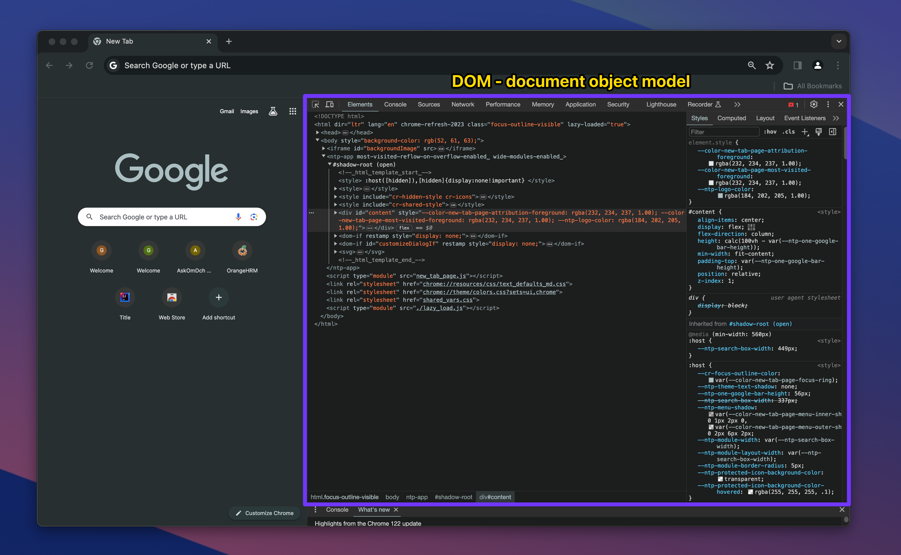

### **What are Developer Tools?**

Developer Tools are a set of utilities integrated into web browsers that allow developers to inspect, debug, and analyze the web pages they are working on. These tools can examine HTML elements, CSS styles, JavaScript code, and network activity, among other functionalities.

> 

### **Opening Developer Tools**

1. **Right-Click and Inspect**: The quickest way to open Developer Tools is by right-clicking on any element on a webpage and selecting "Inspect" from the context menu. This will open the Developer Tools pane and highlight the HTML for the element you right-clicked on.
2. **Using the Menu**:
    - In Google Chrome, click on the three dots in the upper-right corner to open the browser menu.
    - Go to "More tools" > "Developer tools".
3. **Keyboard Shortcut**: You can also use a keyboard shortcut to open Developer Tools.
    - On Windows and Linux, press **`Ctrl`** + **`Shift`** + **`I`**.
    - On MacOS, press **`Cmd`** + **`Opt`** + **`I`**.
    - Also, for both OS we can use F12 as well.
   

### **Exploring Developer Tools Sections**

Once open, you'll see several tabs within the Developer Tools pane. Here are a few key sections:

1. **Elements**: This tab shows the HTML structure of the current page. You can hover over the elements in this pane to see them highlighted on the webpage. Clicking on an element here allows you to view and edit its HTML and CSS properties.
2. **Console**: The Console tab is used for viewing log messages written by JavaScript code and running JavaScript commands directly. It's a great tool for testing snippets of JavaScript in real-time.
3. **Sources**: In the Sources tab, you can view the files that make up the current webpage, including HTML, CSS, JavaScript, and images. This tab also provides features to debug JavaScript code.
4. **Network**: This tab shows all the network requests made by the webpage, including resources like scripts, stylesheets, and images. It's useful for analyzing page load performance and debugging request issues.

### **Basic Tasks You Can Do**

1. **Inspect and Modify HTML**: In the Elements tab, right-click an element and select "Edit as HTML" to change its content. This is great for experimenting with text changes, links, or even correcting typos on the fly.
2. **Change Styles**: The "Styles" pane on the right side within the Elements tab allows you to modify CSS properties. Click on any property to change its value and see the effect immediately on the webpage.
3. **View Console Messages**: Click on the Console tab to see any errors, warnings, or log messages from the webpage's JavaScript. You can also enter JavaScript commands here to interact with the page.
4. **Analyze Network Activity**: The Network tab provides insights into the resources loaded by the webpage. Refresh the page with this tab open to see how each resource affects the loading time.

> When working with web elements in the Developer Tools, you can use the **`Cmd + F`** (on macOS) or **`Ctrl + F`** (on Windows/Linux) shortcut to quickly search for specific elements or text within the HTML structure. This feature is particularly useful for testing CSS selectors or XPath expressions to ensure they accurately target the desired elements. Here's how you can use it:

### **Testing CSS Selectors or XPath Expressions**

1. **Open Developer Tools**: Right-click on the webpage and select "Inspect" or use the keyboard shortcut to open the Developer Tools.
2. **Navigate to the Elements Tab**: Make sure you are on the "Elements" tab where the HTML structure of the page is displayed.
3. **Activate Search**: Press **`Cmd + F`** (macOS) or **`Ctrl + F`** (Windows/Linux) to activate the search bar within the Developer Tools.
4. **Enter Selector or XPath**: Type in the CSS selector or XPath expression you want to test. As you type, the Developer Tools will highlight the matching elements in the HTML structure.
5. **Review Matches**: Look at the highlighted elements to verify that your selector or XPath expression is targeting the correct elements. The search bar will also display the number of matches found.
6. **Refine Selector or XPath**: If the selector or XPath does not match the expected elements, you can refine it and search again to test the updated expression.