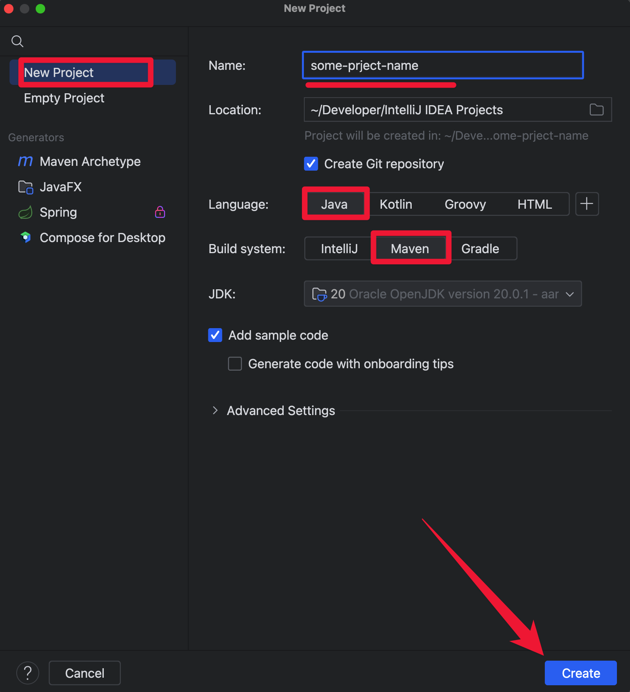

# Setting Up a Maven Project on Mac

## Introduction
> Maven is a powerful project management tool widely used for Java projects. 
> It simplifies the build process, manages dependencies, and more. 
> This guide will walk you through setting up a Maven project on a Mac, covering both manual installation and using Homebrew.


## Prerequisites
- __Java:__ Maven requires Java. Check if you have Java installed by running `java -version` in the Terminal. If not, download and install the JDK [Java Development Kit](https://www.oracle.com/java/technologies/downloads/).
- __IntelliJ IDEA:__ An integrated development environment (IDE) that supports Maven projects. [Download and install IntelliJ IDEA](https://www.jetbrains.com/idea/download/?section=mac#section=mac).

## Installing Maven

### Method 1 - Not Recommended:
1. __Download Maven__: Visit the Apache Maven download [page](https://maven.apache.org/download.cgi) and download the latest version's binary zip file.
2. __Extract Maven__: Extract the downloaded file to a directory of your choice. For example, you can place it in `/usr/local/apache-maven`
   ```bash
   unzip apache-maven-3.8.1-bin.zip -d /usr/local/apache-maven
   ```
3. __Set Environment Variables__: Open your `.zshrc` or `.bash_profile` file in a text editor and add the following lines to set the `M2_HOME` and `PATH` environment variables:
   ```bash
   export M2_HOME=/usr/local/apache-maven/apache-maven-3.8.1
   export PATH=$PATH:$M2_HOME/bin
   ```
4. __Reload Profile__: Run the following command to reload your profile:
    ```bash
   source ~/.zshrc  # or source ~/.bash_profile
    ```
5. __Verify Installation__: Check if Maven is installed correctly by running:
   ```bash
   mvn -version
   ```

### Method 2 - Recommended:
1. __Check if you have homebrew installed on your computer buy running this command in your terminal:__
    ```bash
   brew help
   ```
   - If you get Example usage and other commands then you are good to proceed to maven instalation
   - If you get command not found: brew you will have to install homebrew first by running this command:
     ```bash
     /bin/bash -c "$(curl -fsSL https://raw.githubusercontent.com/Homebrew/install/HEAD/install.sh)"
     ```
     After the installation has been completed proceed to the next step.
2. __Install Maven: Once Homebrew is installed, you can install Maven by running:__ 
    ```bash
   brew install maven
   ```
3. __Verify Installation: Check if Maven is installed correctly by running:__
    ```bash
    mvn -version
   ```

### Setting Up a Maven Project in IntelliJ IDEA

1. __Open IntelliJ IDEA__: Launch the IDE and select "Create New Project" from the welcome screen.

2. __Select Maven__: In the New Project window, choose "Maven" from the left sidebar and make sure the Project SDK is set to your Java version.

3. __Project Details__: Enter the GroupId, ArtifactId, and Version for your project. These are Maven coordinates that uniquely identify your project.

4. __Finish__: Click "Next" and then "Finish" to create your Maven project.

5. __Exploring the Project__: You should now see a pom.xml file in your project. This is the heart of any Maven project, where you define dependencies and plugins.

   []()