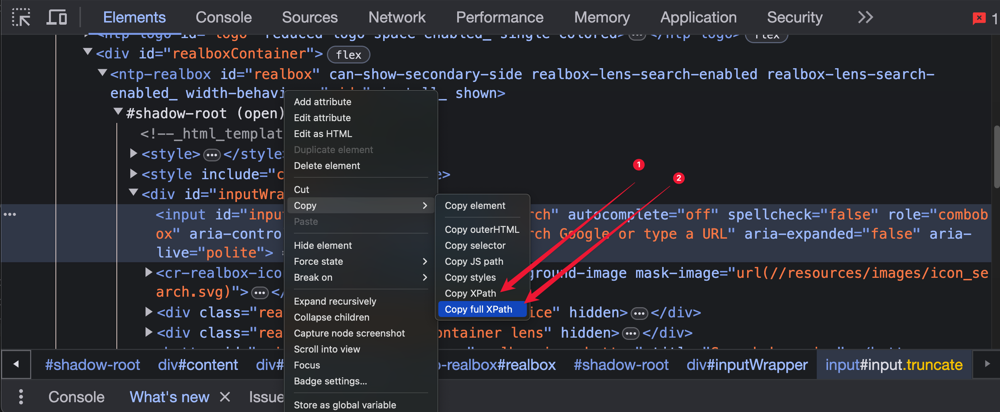

# XPATH

## Introduction:

> _We have previously learned how to locate web elements with different strategies, for example using id, name, className, tagName etc…_

> _Everything is well when these are present and they are unique. However, in real world scenarios there will be many cases that these are not available or there are more than one values we target to locate._

### Types of XPath

__There are two types of xpath that we can use:__

- Absolute
- Relative

###### There are ways to copy it from browser itself but those locator strategies are not really reliable.
>[]()


### XPath Syntax

`//tagName[@attributeName = 'value']`

### **Extended Usage**

To better comprehend how the syntax aids in web element navigation, here are some vital points:

1. **`//` Double Forward Slash**: Directly navigates to an element, enabling a more flexible search without requiring the full path.
2. **`tagName`**: Represents the HTML tag name, such as a, div, p, etc. Utilizing an asterisk (*) serves as a wildcard, representing any tag.
3. **`[]` Square Brackets**: Allow additional filtering, confining the selection to elements that meet specific conditions.
4. **`@` At Symbol**: Signifies an attribute of the current element.
5. **`attributeName`**: Denotes the specific attribute used for identifying the element.
6. **`=` Equal Sign**: Checks for equality between the attribute name and its value.
7. **`'value'`**: Represents the exact attribute value, interchangeable with double quotes ("").

### **Purposes of Using XPath in Selenium:**

XPath is predominantly used for two core purposes in Selenium:

1. **Validation**: Ensure that a given element is uniquely identifiable within the web page, even if it has an **`id`** or **`name`** attribute.
    - *Example Use-Case*: Confirm that an element with a particular **`id`** is singular and not reused elsewhere in the document.
2. **Locator Strategy**: Employ XPath as a strategic method for locating web elements, especially when they do not have specific **`id`** or **`name`** attributes.
    - *Example Use-Case*: Identify elements based on their hierarchical position, text content, or other attributes, particularly when **`id`** or **`name`** are unavailable or unreliable.

> Remember when we pass an xpath to findElement() that has more than one elements located, it will take the very first one. So be carefull.
>

### Variations:

- We can use any `tag` name or `*`
- We can use any attribute that an element can have
- We can use `//a` to count how many links are there, `//img` count all images
- Combine `//` with `/` - skipping generation or not

### **Basic HTML**

    ```html
    <button type="submit" class="btn btn_primary" title="subscribe button" area-lable="subscribe.button">Subscribe</button>
    ```

### 1. Variations of the XPath

| XPath Expression                                 | Explanation                                                                     |
|--------------------------------------------------|---------------------------------------------------------------------------------|
| `//input[@name='uid']`                           | Locates `<input>` elements with the `name` attribute equal to `'uid'`.          |
| `//a[@id='search']`                              | Locates an `<a>` element with the `id` attribute equal to `'search'`.           |
| `//select[@class='offerings']`                   | Locates `<select>` elements with the `class` attribute equal to `'offerings'`.  |
| `//div[@value='RESET']`                          | Locates `<div>` elements with the `value` attribute equal to `'RESET'`.         |
| `//a[@href='http://demo.com/']`                  | Locates `<a>` elements with the `href` attribute equal to `'http://demo.com/'`. |
| `//img[@src='//cdn.amazon.com/images/cake.png']` | Locates `` elements with the `src` attribute containing the image URL.     |
| `//*[@name='fname']`                             | Locates elements of any tag name with the `name` attribute equal to `'fname'`.  |


### 2. **Locating multiple images:**
```html
    <body>
        <div>
            
            
        </div>
    </body>
```
> _**Objective:**_ Locate all image web elements in the given HTML.

> _**Explanation:**_
In the provided HTML, we have two `` tags within a `<div>`. To locate all images, we use the XPath `//img`, which selects all `` elements in the document. This approach is straightforward and effective for retrieving all images without needing additional specifications.

> _**Solution:**_   
> → XPath: `//img`  
> → Java: `driver.findElements(By.xpath("//img"))`

### 3. **Moving to the next generation**
```html
<div id="parentDiv1">
    <span class="childSpan">Hello, World!</span>
    <span name="seleniumSpan">Selenium Class!</span>
</div>
<div id="parentDiv2">
    <span class="childSpan">Hello, Students!</span>
</div>
```
> _**Objective:**_ 
> Locate specific `<span>` elements within given `<div>` elements.  

> _**Explanation:**_ In the given HTML, we have two `<div>` elements each containing `<span>` elements. To locate a specific `<span>` within a `<div>`, we need to specify which `<div>` we're interested in. For example, to select the `<span>` with class `childSpan` in the first `<div>`, we use `//div[@id='parentDiv1']/span[@class='childSpan']`. This XPath expression specifies the `id` of the `<div>` and the `class` of the `<span>` to locate the exact element we need.

> _**Solution:**_  
> → XPath: `//div[@id='parentDiv1']/span[@class='childSpan']`  
> → Java: `driver.findElement(By.xpath("//div[@id='parentDiv1']/span[@class='childSpan']"))`


### 4. **Moving through multiple generations:**

```html
    <div id="parentDiv1">
      <span class="childSpan">Hello, World!</span>
      <span name="seleniumSpan">
        Selenium Class!
        <div class="firstGen">
          First Generation
          <div class="secondGen">
            Second Generation
            <div class="thirdGen">
              Third Generation
              <p class="finalGen">Final Generation</p>
            </div>
          </div>
        </div>
      </span>
    </div>
    <div id="parentDiv2">
      <span class="childSpan">Hello, Students!</span>
    </div>
```
> _**Objective:**_ Locate a `<p>` element nested within multiple generations within a `<span>` element.  

> _**Explanation:**_ In the provided HTML, there is a complex structure of nested elements within the `<span>` with the attribute `name='seleniumSpan'`. To locate the `<p>` element with class `finalGen` that is deeply nested, we use the XPath `//span[@name='seleniumSpan']//p[@class='finalGen']`. This expression starts with the `<span>` element and uses `//` to navigate through multiple generations to find the desired `<p>` element.

> _**Solution:**_  
> → XPath: `//span[@name='seleniumSpan']//p[@class='finalGen']`  
> → Java: `driver.findElement(By.xpath("//span[@name='seleniumSpan']//p[@class='finalGen']"))`

### 5. **Moving from child to immediate parent:**

```html
    <div class="new_class">
      <p id="childPara1">Welcome!</p>
    </div>
    <div class="new_class">
      <p id="childPara2">Bye!</p>
    </div>
```
> _**Objective:**_ Move from a child `<p>` element to its immediate parent element.  

> _**Explanation:**_ In the given HTML, we have `<p>` elements nested inside `<div>` elements with the class `new_class`. To move from a child `<p>` element to its immediate parent, we use the XPath `//p[@id='childPara1']/..`. This expression starts with the `<p>` element with `id='childPara1'` and uses `/..` to navigate to its immediate parent, which is the `<div>` element.

> _**Solution:**_  
> → XPath: `//p[@id='childPara1']/..`    
> → Java: `driver.findElement(By.xpath("//p[@id='childPara1']/.."))`

### 6. **Using Xpath with index:**
```html
<div class="container1">
    <p class="info">Data 1</p>
    <p class="info">Data 2</p>
    <p class="info">Data 3</p>
    <p class="info">Data 4</p>
</div>
<div class="container2">
    <p class="info">Data 1</p>
    <p class="info">Data 2</p>
    <p class="info">Data 3</p>
    <p class="info">Data 4</p>
</div>
```
> _**Objective:**_ Select specific elements based on their position in a collection of similar elements.  

> _**Explanation:**_ In the provided HTML, there are multiple `<p>` elements with the class `info` within two different `<div>` containers. To select a specific `<p>` element based on its position, we use the XPath `(//p[@class='info'])[3]`, which selects the third `<p>` element with the class `info`. Similarly, `//div[@class='container']/div[3]` selects the third `<div>` child of the `<div>` with the class `container`.

> _**Solution:**_  
> → XPath for the third `<p>` with class info:`(//p[@class='info'])[3]`  
> → Java: `driver.findElements(By.xpath("(//p[@class='info'])[3]"))`
> 
> → XPath for the third child `<div>` of container: `//div[@class='container']/div[3]`
> → Java: `driver.findElement(By.xpath("//div[@class='container']/div[3]"))`

### Why not to use index and when to us it

#### Using XPath with indices in test automation with Selenium (or other web testing frameworks) is often discouraged for several reasons:
- **Fragility**: Elements on a webpage can be dynamically generated, added, or removed. Using indices makes the test susceptible to breaking if the order of elements or the number of elements changes.
- **Reduced Readability**: XPath expressions with indices can become complex and hard to decipher, especially for someone who wasn't the original author of the test.
- **Dependence on Page Structure**: Relying on indices implies a dependence on the exact structure of the webpage. Even minor changes, such as adding an additional element, can throw off your indices.
- **Maintenance Overhead**: As websites evolve, the UI might undergo significant changes. If your tests are filled with indexed XPaths, there's a substantial effort involved in updating all of them.
- **Performance Issues**: While this is not solely related to indices, in general, XPath can be slower than CSS selectors, especially in browsers like IE.
- **Generic Selection**: Using an index might indicate that the selector is too generic. It's often better to find a more specific way to identify the element, like using its ID, name, or some unique attribute.
- **Ambiguity**: Just because an element is in position **`[2]`** today doesn't mean it carries the same semantics tomorrow. Selecting, for example, the second button on a page doesn't clearly convey the intent of the test.

#### However, there are scenarios where indices might be the most pragmatic choice, such as:
- When dealing with tables or grids where you want to select a specific row or cell based on its position.
- When the structure of the webpage is known to be static and won't change frequently.
- When no other unique identifiers are present, and adding them is not an option.

### 7. **Use text() function:**

Now instead of using index which is not the best approach.

```html
<div class="content">
    <p>Welcome to the world of XPath!</p>
    <p>This is a tutorial on using the text() function.</p>
    <ul>
        <li>Item 1: Introduction</li>
        <li>Item 2: Basics</li>
        <li>Item 3: Advanced</li>
    </ul>
    <p>Let's dive deeper into XPath functions.</p>
</div>
```

> _**Objective:**_ Select elements based on their text content using the `text()` function in XPath.  

> _**Explanation:**_ In the given HTML, there are multiple `<li>` elements with different text content. To select a specific `<li>` element based on its text, we use the XPath expression that includes the `text()` function. For example, `//li[text()='Item 2: Basics']` selects the `<li>` element with the exact text "Item 2: Basics".

>_**Solution:**_  
> &rarr; XPath: `//li[text()='Item 2: Basics']` 
> &rarr; Java: `driver.findElement(By.xpath("//li[text()='Item 2: Basics']"))`

### Additional Xpath Functions:
> &rarr; Using contains: XPath: `//p[contains(text(),'world of XPath')]`  
> &rarr; Using starts-with: XPath: `//p[starts-with(text(),'Welcome')]` 
> &rarr; Using ends-with: XPath: `//p[ends-with(text(),'functions.')]` 
> _Note: ends-with is available in XPath 2.0_


### 8. **Use Logical Operators**

```html
<div>
    <input name="sampleInput" class="inputClass" type="username">
    <input name="sampleInput" class="inputClass" type="password">
    <input name="sampleInput" class="differentClass" type="text">
</div>

<div>
    <input name="anotherInput" class="inputClass" type="username">
    <input name="anotherInput" class="inputClass" type="password">
    <input name="anotherInput" class="differentClass" type="text">
</div>
```

> _**Objective:**_ Combine conditions using logical operators in XPath to refine element selection.

> _**Explanation:**_ In the given HTML, there are multiple `<input>` elements with different attributes. To select elements based on a combination of conditions, we use logical operators in XPath.
> The `and` operator is used to ensure that both conditions are met, while the `or` operator is used to select elements if either condition is met. 
> For example, `//input[@name='sampleInput' and @class='differentClass']` selects `<input>` elements with the name `"sampleInput"` and the class `"differentClass"`.

>_**Solution:**_  
> _Using `and` operator:_  
> &rarr; XPath: `//input[@name='sampleInput' and @class='differentClass']`  
> &rarr; Java: `driver.findElement(By.xpath("//input[@name='sampleInput' and @class='differentClass']"))`
> 
> > _Using `or` operator:_  
> &rarr; XPath: `//input[@type='username' or @type='password']`  
> &rarr; Java: `driver.findElement(By.xpath("//input[@type='username' or @type='password']"))`

### **Choosing between wildcard and specific tag in xpath:**

- **Specificity:**
    - **//a[@class='action showcart']**: This is more specific because it targets only **`a`** elements with the class **`'action showcart'`**.
    - **//*[@class='action showcart']**: This is more general because it targets any element (**``**) with the class **`'action showcart'`**.

- **Performance:**
    - **//a[@class='action showcart']**: Tends to be faster because it only looks through **`a`** elements in the DOM.
    - **//*[@class='action showcart']**: Could be slower, especially on large pages, because it has to inspect every single element in the DOM to see if it has the specified class.

- **Accuracy:**
    - **//a[@class='action showcart']**: Likely to yield more accurate results by avoiding unwanted elements that might accidentally match.
    - **//*[@class='action showcart']**: Might select undesired elements if they have the same class.

- **Best Practice:**
    - **Using the Tag Name**: Whenever possible, always opt for specifying the tag name in your selectors (when known) as it contributes to creating robust, performant, and accurate locators.

### Common XPath Functions:

| Function            | Description                                                                                                 | Example Usage in XPath                         |
|---------------------|-------------------------------------------------------------------------------------------------------------|------------------------------------------------|
| `text()`            | Selects the text content of an element.                                                                     | `//p[text()='Example']`                        |
| `contains()`        | Checks if an element's text contains a specified substring.                                                 | `//p[contains(text(),'Example')]`              |
| `starts-with()`     | Checks if an element's text starts with a specified substring.                                              | `//p[starts-with(text(),'Example')]`           |
| `ends-with()`       | Checks if an element's text ends with a specified substring.                                                | `//p[ends-with(text(),'Example')]` (XPath 2.0) |
| `not()`             | Negates a condition.                                                                                        | `//p[not(contains(text(),'Example'))]`         |
| `count()`           | Counts the number of nodes in a node-set.                                                                   | `count(//p)`                                   |
| `position()`        | Returns the position of a node in a node-set.                                                               | `//p[position()=1]`                            |
| `last()`            | Returns the last node in a node-set.                                                                        | `//p[last()]`                                  |
| `normalize-space()` | Strips leading and trailing whitespace and replaces sequences of whitespace characters with a single space. | `//p[normalize-space(text())='Example']`       |
